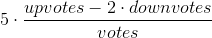

# Wadaff : vade-mecum

## Concept

Wadaff is an app that allow its user to find quality events of a given type in real time. It is made of a map around the user that shows all the ongoing events and sort them by the quality of their music. These events are filtered by types. The type can be a musical style (house, techno, rock, jazz, etc) or bar-atmosphere. Each event has a score based on amount of people who think the given type is properly represented at the event. To make that score, when a user is located close to an event, the app will ask him two simple questions. For instance:

- Are you at TGIF rooftop afterwork ? Yes / No
- Is good house music playing ? Yes / No

On the one side, every time an user answer this kind of question, he earns one point. On the other side, the score of an event is computed according to the answer. Later on, the user will be able to get some rewards with its points.

## Features
### Push notifications

Scores of the events are computed according to this formula:

### Friend filter

Users can apply a filter on the map to see at what events their friends are

### Popup friends reunion

Users can receive a popup once more than `n` friends are located at the same event. The `n` value is configurable in the settings

Rewards
-------

The app uses the gamification principle. Through their action, the users gets points. These points will allow them to gets some rewards.

### Event creators

The event creators get

- +1 point for 10 upvotes on their event
- -1 point for 5 downvotes on their event

### Checkouts

Users get +1 point every time their upvote a place.

### Troll detection

People who mainly downvote event are banned. 

## Front-end design

### Main page

#### Buttons
- [Top left] burger button (web only)
- [Top center] list chooser: style (house, techno, etc)
- [Bottom right] button: recenter map on current location
- [Bottom right] button: toggle friends filter
- [Bottom right] button: add an event

#### Side panel
Always displayed on desktop version

- User profile
- Settings
  - Localization type
    - no location push notifications
    - push notifications when located at an event
    - continuous localization (show to your friends where you are, only ask for music quality)
  - Notifications
    - Friend reunion

#### Map
##### Pins

- 1 pin / event  
- score of the event written in the pin
- color of the pin change according to the score
- if the friend filter is enabled, amount of friends is displayed in the pin instead of the score

##### Tap event on a pin
Tooltip displaying:

- title
- short description
- arrow to open event page

### Event info page
#### Event information
- Title
- Type
- Score
- Description
- Comments
- [optional] Link to Facebook event
- Button: share this event

#### If the user is currently at the event
- buttons to change its vote
- button to add a comment

### Add event page
#### Ways to create an event

An event can be added to the database in two ways:

- In real time: free option, open to anyone. The event must have started.
- In front: paid option (free before the app gets known). The user can register an event in front. The event will appear in the app once it has started.

#### Form
- Text field: styles (max 3, 1 is recommended) with a prediction (like hashtags) according to their popularity
- Checkbox: "This event is not related to a Facebook event" -> add some extra fields in the form.

**If related to a Facebook event**:

- Search bar: choose a city
- Search bar : search for the event on Facebook

OR

- Text field: hyperlink to the Facebook event

**If not related to a Facebook event:** 

- Text field: title
- Location : triggers a  picker on the map
- Date picker: date and time
  - condition: the event cannot last more than a week (to avoid permanent events)
- Text field: description
- Checkbox: disclaimer saying that the user assume he is the owner of the event

## Back-end design

## Database design

